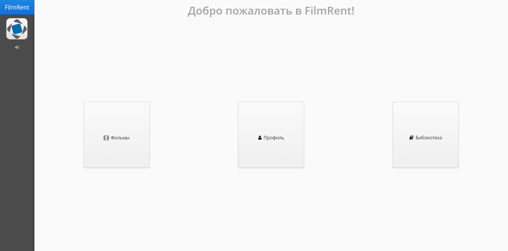
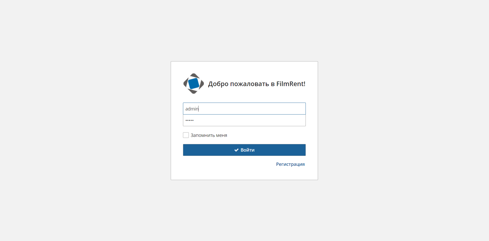
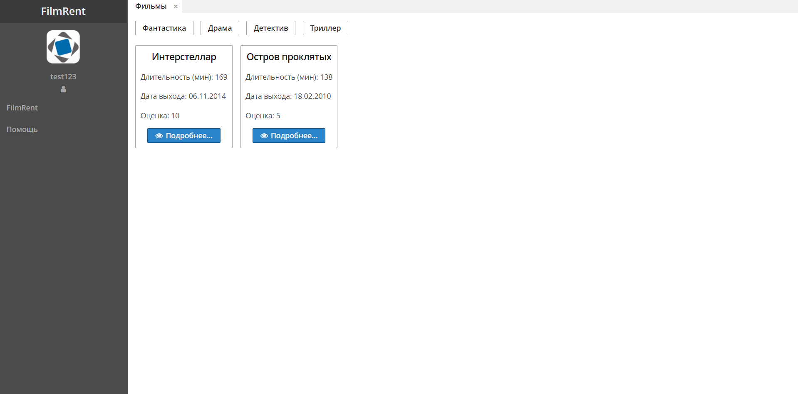
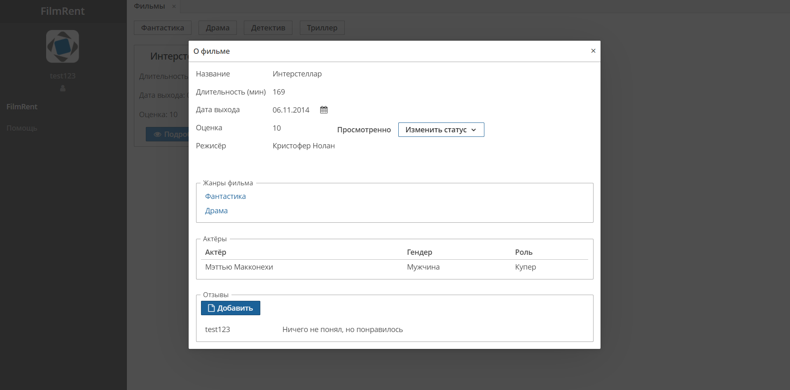
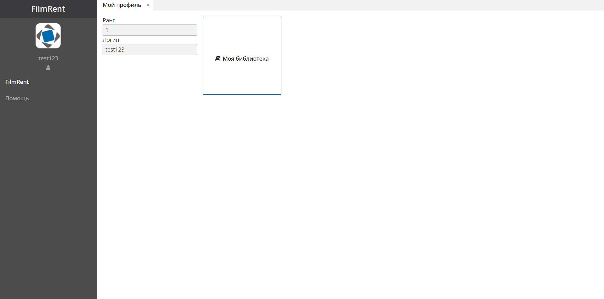
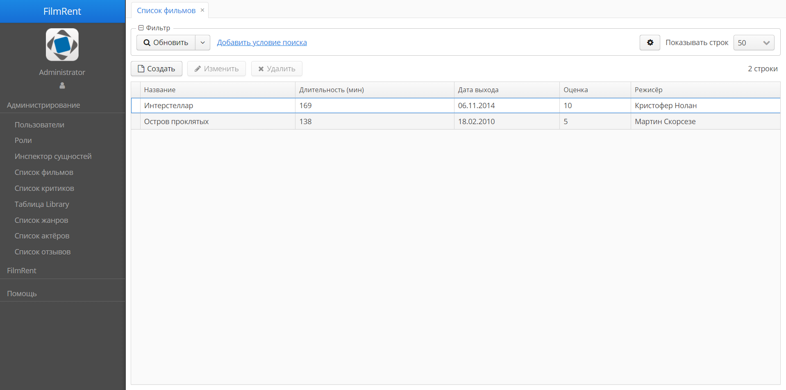
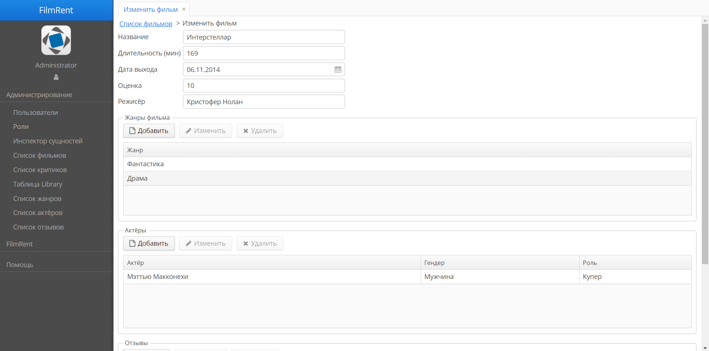

# Film Rent

## How to run

1. First step - change env.txt

```bat
rem ...........................
rem CHANGE IT TO YOUR JAVA PATH
set "JRE_HOME=C:\Program Files\Java\jdk1.8.0_281"
rem ...........................
```

2. Check db connection parameters in `modules\core\src\com\company\filmrent\app.properties`

```properties
cuba.dataSource.username = postgres
cuba.dataSource.password = root
```

**After this, all steps will be about Windows**

3. Run `filmrent-build.bat`. It only needs at the first time.

4. For starting the server - run `start.bat`. You will see the Tomcat log terminal.

5. For stoping the server - run `stop.bat`. Also, you can stop the server by pressing Ctrl+C in the Tomcat log terminal.

# Screens examples
Main page

Login page

Films list

Film card

Profile page

Admin browser screen

Admin editor screen


# SQL scripts examples

```sql
-- create tables
-- begin LIBRARY
create table Library (
    ID uuid,
    VERSION integer not null,
    CREATE_TS timestamp,
    CREATED_BY varchar(50),
    UPDATE_TS timestamp,
    UPDATED_BY varchar(50),
    DELETE_TS timestamp,
    DELETED_BY varchar(50),
    --
    Id_user uuid not null,
    Id_movie uuid not null,
    isLooked boolean not null,
    --
    primary key (ID)
)^
alter table Library add constraint FK_LIBRARY_ON_ID_USER foreign key (ID_USER) references LocalUser(ID)^
alter table Library add constraint FK_LIBRARY_ON_ID_MOVIE foreign key (ID_MOVIE) references Movies(ID)^
create index IDX_LIBRARY_ON_ID_USER on Library (ID_USER)^
create index IDX_LIBRARY_ON_ID_MOVIE on Library (ID_MOVIE)^
-- end LIBRARY
```

# JPQL queries examples

```hql

select m from filmrent_Movie m

select l from filmrent_Library l where l.movie = :movie and l.critic = :critic

select l.movie from filmrent_Library l where l.updateTs > :monthAgo and l.isLooked = TRUE and l.critic = :critic

select g from filmrent_Genre g where g in (select mg.genre from filmrent_MovieGenre mg)

select mg from filmrent_MovieGenre mg join mg.movie m where m in (select l.movie from filmrent_Library l where l.isLooked = TRUE and l.critic = :critic)

select count(l) from filmrent_Library l where l.movie = :movie
```