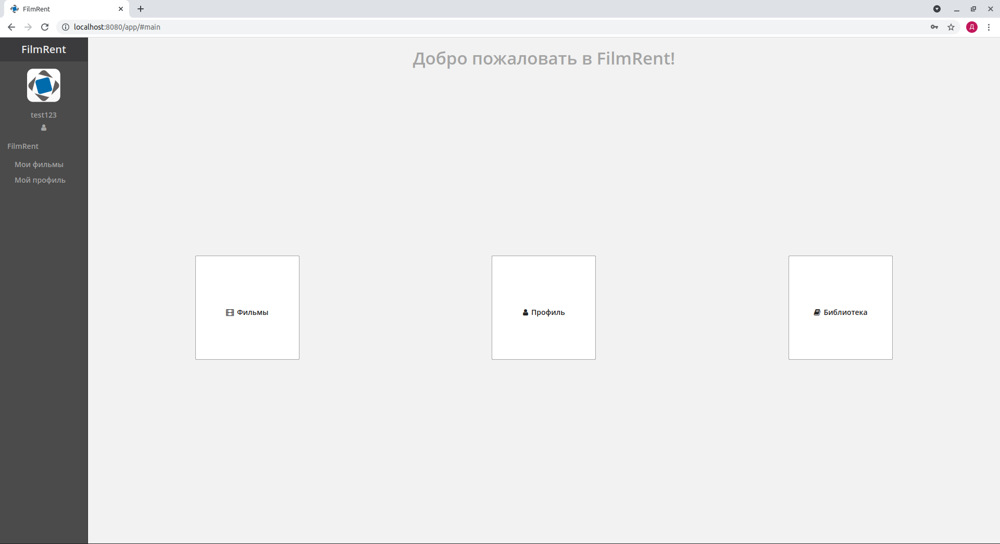
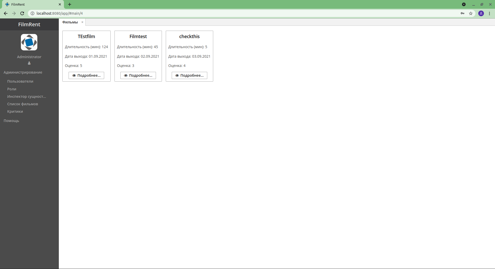
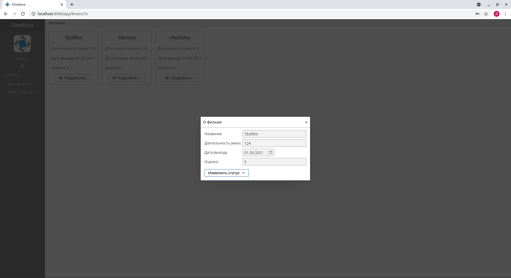
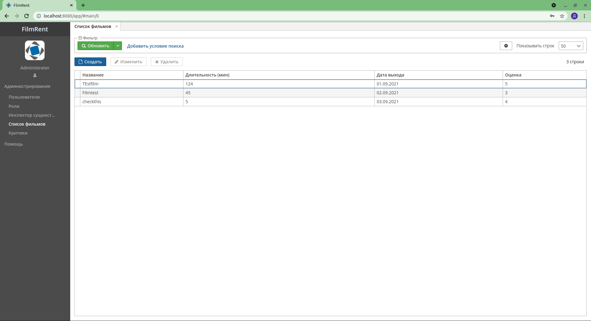
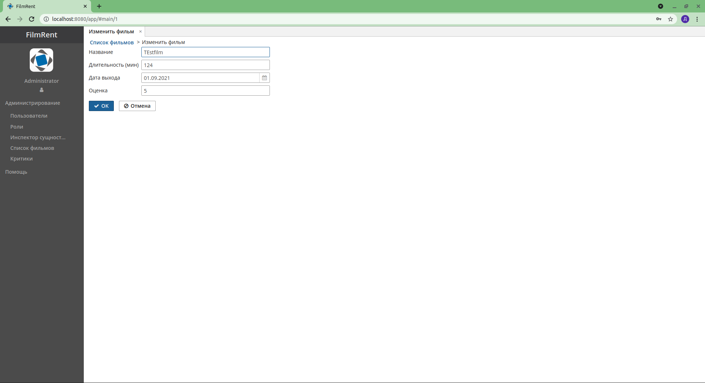
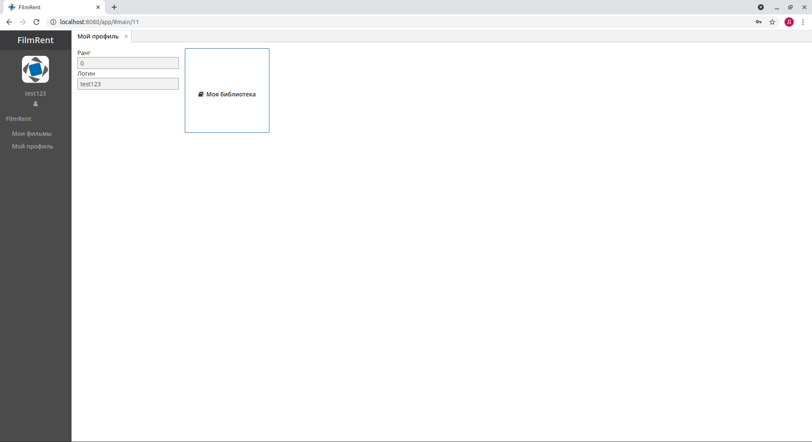
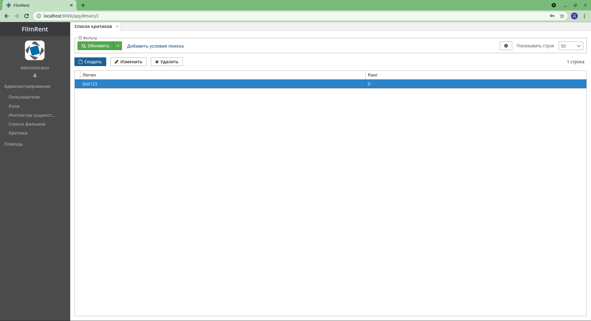
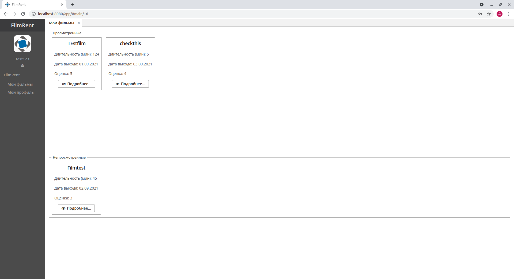
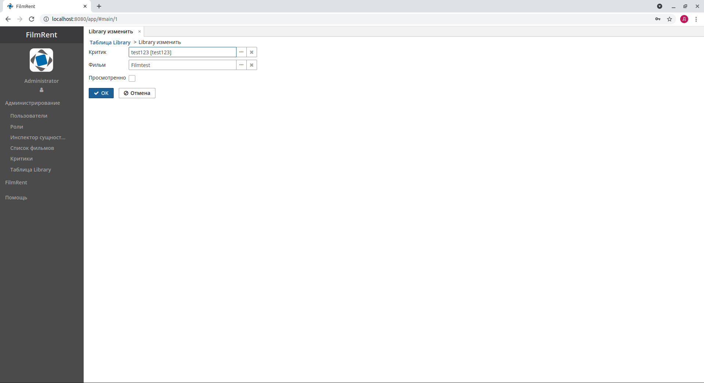
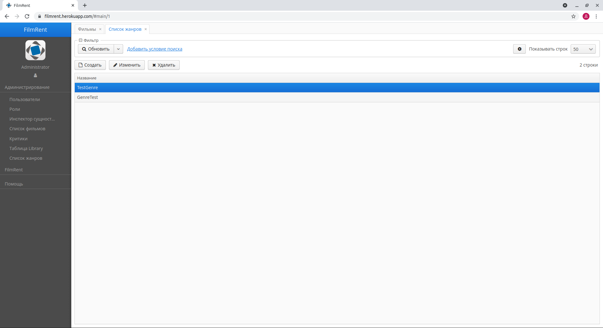

# Screens

Main page

Login page

Films view

Film card

Films list

Edit film

Critic card

Critics list

Critic edit

Library view

Library list

Library edit

Genre list

Genre edit

Genre filter


# SQL scripts

```sql
-- begin MOVIES
create table Movies (
    ID uuid,
    VERSION integer not null,
    CREATE_TS timestamp,
    CREATED_BY varchar(50),
    UPDATE_TS timestamp,
    UPDATED_BY varchar(50),
    DELETE_TS timestamp,
    DELETED_BY varchar(50),
    --
    Movie_title varchar(255) not null,
    Movie_time integer not null,
    Movie_data_release date not null,
    Num_of_rating integer not null,
    --
    primary key (ID)
)^
-- end MOVIES
-- begin LOCALUSER
create table LocalUser (
    ID uuid,
    VERSION integer not null,
    CREATE_TS timestamp,
    CREATED_BY varchar(50),
    UPDATE_TS timestamp,
    UPDATED_BY varchar(50),
    DELETE_TS timestamp,
    DELETED_BY varchar(50),
    --
    User_rang integer not null,
    User_id uuid not null,
    --
    primary key (ID)
)^
alter table LocalUser add constraint FK_LOCALUSER_ON_USER foreign key (USER_ID) references SEC_USER(ID)^
create index IDX_LOCALUSER_ON_USER on LocalUser (USER_ID)^
-- end LOCALUSER
-- begin LIBRARY
create table Library (
    ID uuid,
    VERSION integer not null,
    CREATE_TS timestamp,
    CREATED_BY varchar(50),
    UPDATE_TS timestamp,
    UPDATED_BY varchar(50),
    DELETE_TS timestamp,
    DELETED_BY varchar(50),
    --
    Id_user uuid not null,
    Id_movie uuid not null,
    isLooked boolean not null,
    --
    primary key (ID)
)^
alter table Library add constraint FK_LIBRARY_ON_ID_USER foreign key (ID_USER) references LocalUser(ID)^
alter table Library add constraint FK_LIBRARY_ON_ID_MOVIE foreign key (ID_MOVIE) references Movies(ID)^
create index IDX_LIBRARY_ON_ID_USER on Library (ID_USER)^
create index IDX_LIBRARY_ON_ID_MOVIE on Library (ID_MOVIE)^
-- end LIBRARY
-- begin GENRES
create table Genres (
    ID uuid,
    VERSION integer not null,
    CREATE_TS timestamp,
    CREATED_BY varchar(50),
    UPDATE_TS timestamp,
    UPDATED_BY varchar(50),
    DELETE_TS timestamp,
    DELETED_BY varchar(50),
    --
    Genre_title varchar(255) not null,
    --
    primary key (ID)
)^
-- end GENRES
-- begin MOVIE_GENRES
create table Movie_genres (
    ID uuid,
    VERSION integer not null,
    CREATE_TS timestamp,
    CREATED_BY varchar(50),
    UPDATE_TS timestamp,
    UPDATED_BY varchar(50),
    DELETE_TS timestamp,
    DELETED_BY varchar(50),
    --
    Movie_id uuid not null,
    Genre_id uuid not null,
    --
    primary key (ID)
)^
alter table Movie_genres add constraint FK_MOVIE_GENRES_ON_MOVIE foreign key (MOVIE_ID) references Movies(ID)^
alter table Movie_genres add constraint FK_MOVIE_GENRES_ON_GENRE foreign key (GENRE_ID) references Genres(ID)^
create index IDX_MOVIE_GENRES_ON_MOVIE on Movie_genres (MOVIE_ID)^
create index IDX_MOVIE_GENRES_ON_GENRE on Movie_genres (GENRE_ID)^
-- end MOVIE_GENRES
-- begin ACTORS
create table Actors (
    ID uuid,
    VERSION integer not null,
    CREATE_TS timestamp,
    CREATED_BY varchar(50),
    UPDATE_TS timestamp,
    UPDATED_BY varchar(50),
    DELETE_TS timestamp,
    DELETED_BY varchar(50),
    --
    Actor_firstname varchar(255) not null,
    Actor_lastname varchar(255) not null,
    Actor_gender varchar(255) not null,
    --
    primary key (ID)
)^
-- end ACTORS
-- begin MOVIES_CAST
create table Movies_cast (
    ID uuid,
    VERSION integer not null,
    CREATE_TS timestamp,
    CREATED_BY varchar(50),
    UPDATE_TS timestamp,
    UPDATED_BY varchar(50),
    DELETE_TS timestamp,
    DELETED_BY varchar(50),
    --
    Movie_id uuid not null,
    Actor_id uuid not null,
    Role varchar(255) not null,
    --
    primary key (ID)
)^
-- begin MOVIES_CAST
alter table Movies_cast add constraint FK_MOVIES_CAST_ON_MOVIE foreign key (MOVIE_ID) references Movies(ID)^
alter table Movies_cast add constraint FK_MOVIES_CAST_ON_ACTOR foreign key (ACTOR_ID) references Actors(ID)^
create index IDX_MOVIES_CAST_ON_MOVIE on Movies_cast (MOVIE_ID)^
create index IDX_MOVIES_CAST_ON_ACTOR on Movies_cast (ACTOR_ID)^
-- end MOVIES_CAST
```

# JPQL queries examples

```hql
select l from filmrent_Library l where l.movie = :movie and l.critic = :critic

select c from filmrent_Critic c where c.user = :user

select m from filmrent_Movie m

select g from filmrent_MovieGenre g where g.movie = :movie

select mg.movie from filmrent_MovieGenre mg where mg.genre = :genre

select g from filmrent_Genre g where g in (select mg.genre from filmrent_MovieGenre mg)

select e from filmrent_Critic e where e.userRang > :rang

select l.movie from filmrent_Library l where l.updateTs > :monthAgo and l.isLooked = TRUE and l.critic = :critic

select mg from filmrent_MovieGenre mg join mg.movie m where m in (select l.movie from filmrent_Library l where l.isLooked = TRUE and l.critic = :critic)
```